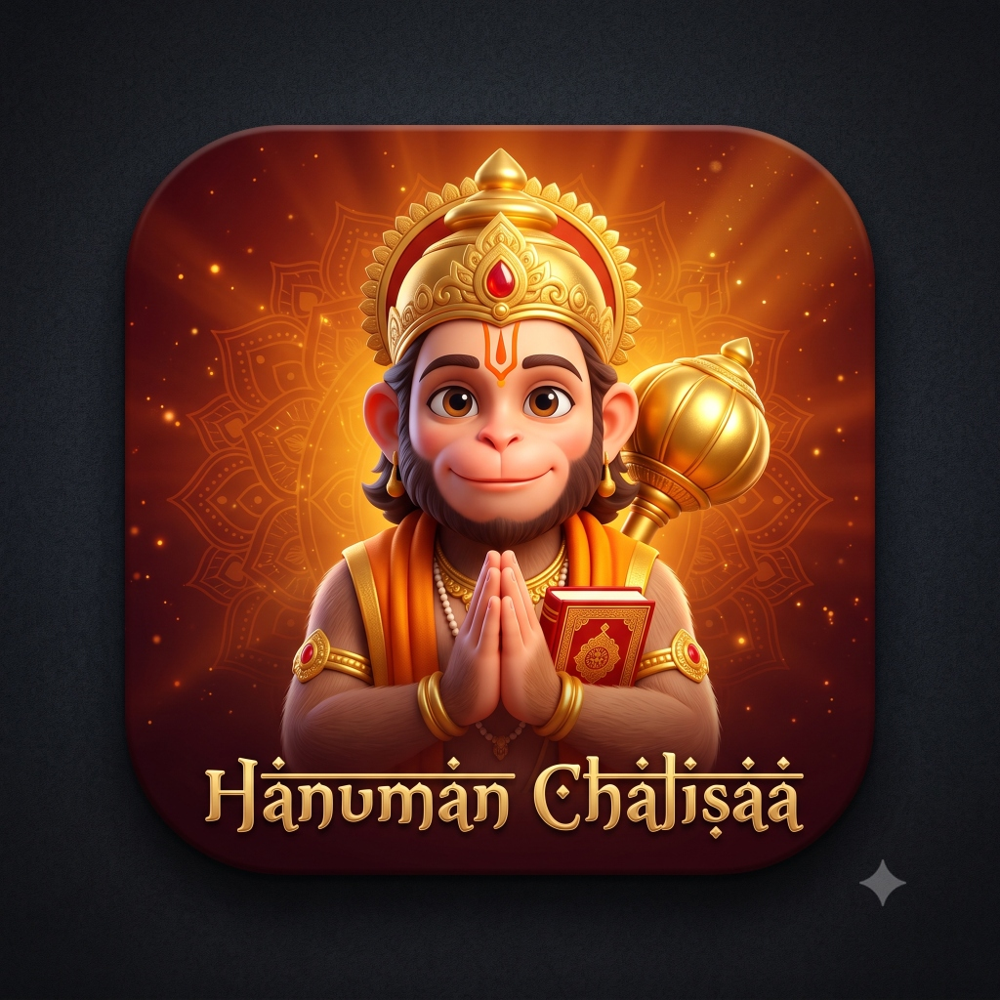

# Shree Hanuman Chalisa (श्री हनुमान चालीसा)

A modern, devotional cross-platform application for reciting, studying, and chanting the sacred **Shree Hanuman Chalisa** (composed by Goswami Tulsidas), crafted with Flutter.



---

## ✨ Features

- **📜 Tri-Scripture & Meaning View**:
  - Full Awadhi / Devanagari text (`अवधी`)
  - Full Telugu script (`తెలుగు`)
  - Bilingual side-by-side mode (`Both / ఉభయ`)
  - Roman transliteration & inline English meanings for every Chaupai and Doha.
- **🎧 Guided Recitation & Audio Companion**:
  - **Traditional Chanting**: Sacred vocal chanting audio streaming.
  - **Meditative Tanpura**: Calming ambient drone accompaniment.
  - **Silent Guided Auto-Scroll**: Offline timer-driven auto-scrolling at custom reading paces (`0.75x`, `1.0x`, `1.25x`, `1.5x`).
  - Active verse highlighting with golden glow and tap-to-recite jump capability.
- **🎨 2D Storyboard Animation**:
  - Warm, playful 2D animated sequence of young Bal Hanuman and his magical golden Gada.
  - Timeline scrubber across 4 phases: Peeking & Gada Hover ➔ Dynamic Leap ➔ Catch Impact Starburst ➔ Respectful Pranam & Begin Journey.
- **📿 Devotional Japa Counter**:
  - Digital counter with haptic feedback, daily streaks, target goals (`1, 3, 7, 11, 21, 54, 108`), and auspicious Parayan completion dialogues.
- **🌙 Temple Night Palette**:
  - High-contrast obsidian night dark mode & warm sandalwood daylight theme.

---

## 🚀 Getting Started

### Prerequisites
- [Flutter SDK](https://flutter.dev/docs/get-started/install) (3.13.0+)
- Dart 3+

### Installation & Run

```bash
# Clone the repository
git clone https://github.com/manoharbhudeti/Hanuman_Chalisaa.git
cd Hanuman_Chalisaa

# Install Flutter dependencies
flutter pub get

# Run on your preferred platform (Chrome / Windows / Android / iOS)
flutter run
```

### Production Web Build & Local Hosting

```bash
# Build production web bundle
flutter build web --release

# Host locally
node host_release.js
# Access at http://127.0.0.1:5050
```

---

## 🏛️ Architecture

- **`lib/models/`**: `ChalisaVerse`, `ChalisaData` JSON data models.
- **`lib/providers/`**:
  - `RecitationProvider`: Audio chanting, synchronization, verse timestamps, and auto-scroll engine.
  - `CounterProvider`: Japa counting, daily targets, and streak tracking.
  - `ReadingSettingsProvider`: Font size, language mode, and transliteration preferences.
  - `ThemeProvider`: Material 3 sacred saffron / temple obsidian theme toggling.
- **`lib/screens/`**:
  - `OnboardingAnimationScreen`: 2D animated Bal Hanuman splash onboarding.
  - `HomeScreen`: Bottom navigation shell.
  - `ReadingScreen`: Full Chalisa verses, recitation player dock, and auto-scroller.
  - `MeaningScreen`: Searchable verse-by-verse commentary and spiritual insights.
  - `CounterScreen`: Dedicated Japa Mala counter with bead progress rings.
  - `SettingsScreen`: Customizations, audio preferences, and devotional info.
- **`lib/widgets/`**:
  - `HanumanIntroAnimation`: 4-phase canvas & keyframe animation with squish-and-stretch physics.
  - `RecitationBottomBar`: Glassmorphic floating audio & auto-scroll mini-player.
  - `RecitationSheet`: Full companion sheet with seeker, speeds, and 43-verse quick picker.
  - `VerseCard`: Card with interactive highlighting, copy, and ribbon badges.

---

## 🙏 Credits

Dedicated to Lord Hanuman. May this application bring strength, peace, and devotion to all seekers.
